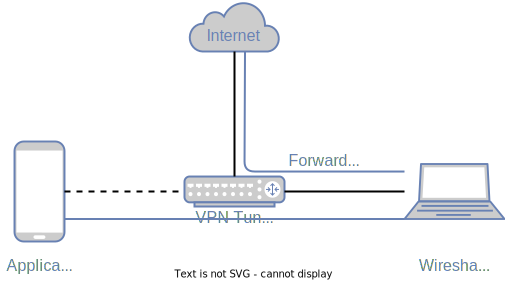
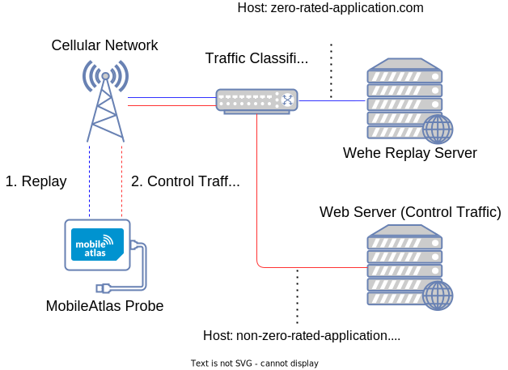
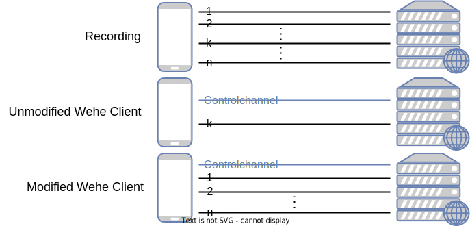

# Modified Wehe Server for MobileAtlas

This repository contains a modified version of the
[Wehe server](https://github.com/NEU-SNS/wehe-server) used to detect economic differentiation in
mobile networks via traffic replaying using the MobileAtlas measurement platform.

## Project Overview

### The Wehe Project

[Wehe](https://wehe.meddle.mobi) is a project that provides a framework for detecting differential
treatment of network traffic — i.e. the blocking or throttling of specific types of traffic. WEHE
provides a mobile client allowing volunteers to check whether their ISP throttles some applications'
traffic — it offers tests for select commonly used apps such as YouTube, Netflix, and Skype. The
mobile client communicates with a server to replay the prerecorded traffic captures twice — first
unaltered and then as control traffic by transforming the original payloads, thus preventing the
control traffic from being correctly classified and throttled. The server then compares throughput
samples collected during the two replays to determine the presence of differential traffic
treatment. Because of the use of a custom replay server, WEHE cannot detect traffic differentiation
that is IP address based.

### MobileAtlas

[MobileAtlas](https://www.mobileatlas.eu/) is a measurement platform for experiments
with cellular network roaming. It consists of multiple probes hosted in different countries, each
having a modem and a wired internet connection. The novel approach taken by MobileAtlas is that
instead of each Probe having its own fixed sim card, communication between the modem and the sim
card gets tunnelled over the internet. This approach enables the geographic decoupling of sim cards
and probes, leading to better scalability and flexibility.

### MobileAtlas Wehe Tests

To create our tests, we recorded network traffic of five different applications: WhatsApp, Snapchat,
Facebook Messenger, FM4 (an Austrian radio station) app, and FM4 web client.

We installed the applications and connected the phones to a Wireguard VPN to intercept and record
network traffic. The image below shows the VPN setup: The phone sends/receives network traffic over
the VPN tunnel to/from a Laptop (sitting in the same local network), recording the VPN traffic that
acts as a router and forwards all packets to the internet.

<picture>
  <source media="(prefers-color-scheme: dark)" srcset="./graphics/VPN-setup-whitebg.svg">
  <source media="(prefers-color-scheme: light)" srcset="./graphics/VPN-setup.svg">
  
</picture>

With this setup, we recorded different usage patterns of the applications — trying to make sure
recordings are at least 1MB in size — e.g. with Snapchat we recorded a session only using the
Spotlight feature (`snapchat_spotlight_1.mp4`).

These recorded pcaps can be found in the `pcaps/` directory. This directory also contains screen
captures showing how the applications were used while recording the pcaps.

Running our tests involves installing the modified client on MobileAtlas probes in different
countries and running replays of applications included in a zero-rating offer against the modified
replay server. Supposing the ISP's traffic classification infrastructure uses the TLS SNI extension
or the HTTP Host header to decide whether to zero-rate traffic, some replayed conversations should
be zero-rated and thus not incur any cost. Next, we request data from a service not included in a
zero-rating offer to determine whether non-zero-rated traffic is billed as expected (and also to
detect whether the replay traffic has been included in its entirety in the current bill).

<picture>
  <source media="(prefers-color-scheme: dark)" srcset="./graphics/MobileAtlasWehe-whitebg.svg">
  <source media="(prefers-color-scheme: light)" srcset="./graphics/MobileAtlasWehe.svg">
  
</picture>

## Changes to the Wehe Server

We implemented the following changes while integrating Wehe into the MobileAtlas framework:

### Supporting multiple TCP and UDP conversations per test

Initially, Wehe supported only one TCP/UDP conversation per Test. Our changes make it possible to
create tests from PCAP files that contain many TCP and UDP streams and thus allow tests to better
reflect the behaviour of the actual applications.

<picture>
  <source media="(prefers-color-scheme: dark)" srcset="./graphics/ModifiedWehe-whitebg.svg">
  <source media="(prefers-color-scheme: light)" srcset="./graphics/ModifiedWehe.svg">
  
</picture>

### IPv6 support

We added support that allows replaying conversations that happened over IPv6. It is impossible to
replay network traffic that was initially IPv6 over IPv4 and vice versa. If a replay client cannot
use IPv6, all IPv6 traffic is skipped while replaying. To allow the replaying of IPv6 traffic even
when IPv6 is unavailable, we introduced an option in the replay parser (the program responsible for
parsing pcap files to create tests) that allows translating all IPv6 traffic to IPv4.

### Removal of analysis server

Since we want to study economic differentiation, we do not start the analysis server that performs
the statistical analysis to detect DPI-based throttling via throughput data.

### Changes in test generation

The replay parser (the program that parses pcap files to generate Wehe test files) ignored all
conversations with Apple IP addresses (`17.0.0.0/8`) by default. Therefore, we removed this filter
to keep the replays closer to the original recordings. 

## Adding new Tests

Record the traffic by using tcpdump, e.g., running tcpdump while watching a video and save the pcap
file as app1.pcap. We will use the parser script to process the pcap and create the replay files (in
JSON/Pickle format) that can be used by the client and server.

Assume the pcap is stored in `the/dir/to/pcap`.

* Create the file `the/dir/to/pcap/client_ip.txt` containing the IPv4 and IPv6 addresse the client
  uses in the recording. E.g:

```
10.10.10.2
fc00::2
```

* Use the replay parser to generate the replay files:
  To convert IPv6 traffic to IPv4 use the `--convert_to_ipv4=true` option:

```bash
sudo docker run -it --rm -v "the/dir/to/pcap":/replay_folder --entrypoint /usr/bin/env wehe python
replay_parser.py --pcap_folder="/replay_folder" --convert_to_ipv4=<true|false>
```

```bash
python replay_parser.py --pcap_folder=the/dir/to/pcap --convert_to_ipv4=<true|false>
```

* Copy the server replay file (`<testname>.pcap_server_all.pickle`) and the file containing the client IPs (`client_ip.txt`) to a new directory `replayTraces/<testname>` and add an
  entry to `src/folders.txt`

* Follow the [instructions in the client
  repository](https://github.com/phfrenzel/wehe-cmdline#adding-new-tests) to add the generated
  client replay file to the modified wehe client.

## About the Code

* The `src/` directory contains the source files.
* The `src/folders.txt` file contains a list of all test directories loaded by the server on startup
* The `pcaps/` directory contains the recorded pcap files and the corresponding screen captures.
* The `replayTraces/` directory contains one directory per test containing the test file generated
  by the replay parser and a file (`client_ip.txt`) containing the IP address(es) of the client in
  the original
  recording

## Usage

How to run a replay step by step:

Set up Wehe server:

* Follow the steps in rootcahowto.txt to generate a self-signed certificate for secured communication.
* Start the replay server with `./startserver.sh`

Instructions on how to use the modified Wehe client can be found in its
[repository](https://github.com/phfrenzel/wehe-cmdline).

**NOTE:** Running the server outside of a container requires python 2.7 and the dependencies in
`requirements.txt`. It also requires `tshark`, `openssl`, and `tcpdump` to be installed.

## Containerization

This API has been containerized. To run it within a container first go to the cloned directory and build with 
```
sudo docker build . -t wehe
```

Then run with 
```
sudo docker run -v <where/the/certs/are>:/wehe/ssl -v <where/to/save/the/output/on/host>:/data/RecordReplay --env SUDO_UID=$UID --net=host -itd wehe
```

Remove d from `-itd` to run outside of detached mode and see the output in STDOUT

## Funding

This project is funded through the [NGI0 PET](https://nlnet.nl/PET) Fund, a fund established by
NLnet with financial support from the European Commission's [Next Generation
Internet](https://ngi.eu/) programme, under the aegis of DG Communications Networks, Content and
Technology under grant agreement No 825310.
